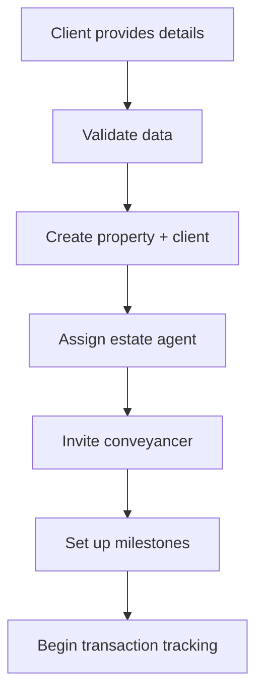

# Integration Patterns & Workflows

Real-world integration patterns for common OpenMoove Partner API use cases. Learn how to implement robust workflows that handle the complexities of property transactions.

---

## 🏗️ Pattern Overview

### Workflow Categories
- **[Property Creation Patterns](#-property-creation-patterns)** - Different ways to create properties
- **[Professional Management](#-professional-management)** - Team assignment and invitation flows
- **[Milestone Tracking](#-milestone-tracking)** - Progress monitoring and updates
- **[Error Handling](#-error-handling-patterns)** - Robust error recovery
- **[Polling & Webhooks](#-polling--webhooks)** - Real-time vs periodic updates

---

## 🏠 Property Creation Patterns

### Pattern 1: Standard Property Sale

**Use Case:** Estate agent creates a standard property sale for a new client.

**Workflow:**


**Implementation:**
```python
def create_standard_property(client_data):
    """Create a standard property sale with full validation"""
    
    # Step 1: Validate required fields
    required_fields = ['first_name', 'last_name', 'email', 'phone_number', 
                      'property_address', 'property_postcode']
    
    for field in required_fields:
        if not client_data.get(field):
            raise ValueError(f"Missing required field: {field}")
    
    # Step 2: Ensure professional team
    if not client_data.get('estate_agent_email'):
        client_data['estate_agent_email'] = 'default-agent@youragency.com'
    
    # Step 3: Add standard sale specifics
    payload = {
        **client_data,
        'sale_method': 'standard',
        'products': ['moove-ready-pack']  # Standard product
    }
    
    # Step 4: Create with error handling
    try:
        response = api.post('/clients/', json=payload)
        response.raise_for_status()
        
        result = response.json()
        
        # Step 5: Log creation for tracking
        log_property_creation(
            property_id=result['property_id'],
            transaction_id=result['property']['transactionId'],
            client_email=client_data['email']
        )
        
        return result
        
    except requests.HTTPError as e:
        if e.response.status_code == 400:
            # Handle validation errors
            error_data = e.response.json()
            raise ValidationError(f"Property creation failed: {error_data}")
        raise
```

**cURL Example:**
```bash
curl -X POST \
  -H "Content-Type: application/json" \
  -H "X-API-KEY: om_your_key" \
  -d '{
    "first_name": "John",
    "last_name": "Smith",
    "email": "john.smith@example.com",
    "phone_number": "+447700900123",
    "property_address": "123 High Street, London",
    "property_postcode": "SW1A 1AA",
    "sale_method": "standard",
    "estate_agent_email": "agent@youragency.com",
    "conveyancer_email": "lawyer@lawfirm.com",
    "products": ["moove-ready-pack"]
  }' \
  "https://staging.openmoove.com/api/v1/partners/clients/"
```

### Pattern 2: Modern Auction Workflow

**Use Case:** Auctioneer creates a modern method auction property.

**Key Differences:**
- Requires `auctioneer_email`
- Different milestone template
- Auction-specific PDTF data

**Implementation:**
```python
def create_auction_property(client_data, auction_details):
    """Create modern method auction property"""
    
    # Validate auction requirements
    if not client_data.get('auctioneer_email'):
        raise ValueError("Auctioneer email required for auction sales")
    
    # Auction-specific payload
    payload = {
        **client_data,
        'sale_method': 'modern_auction',
        'auctioneer_email': auction_details['auctioneer_email'],
        'estate_agent_email': auction_details.get('estate_agent_email'),
        'products': ['moove-ready-pack']
    }
    
    try:
        response = api.post('/clients/', json=payload)
        result = response.json()
        
        # Auction properties get different milestones
        # Verify auction milestones were created
        milestones = api.get(f"/properties/{result['property']['transactionId']}/milestones/")
        
        auction_specific_milestones = [
            'Legal Pack Preparation',
            'Auction Marketing Period',
            'Auction Exchange',
            'Completion'
        ]
        
        milestone_names = [m['name'] for m in milestones.json()]
        for required_milestone in auction_specific_milestones:
            if required_milestone not in milestone_names:
                logger.warning(f"Missing auction milestone: {required_milestone}")
        
        return result
        
    except requests.HTTPError as e:
        handle_auction_creation_error(e, client_data)
        raise

def handle_auction_creation_error(error, client_data):
    """Handle auction-specific creation errors"""
    if error.response.status_code == 400:
        error_data = error.response.json()
        
        # Common auction errors
        if 'auctioneer_email' in str(error_data):
            logger.error(f"Auctioneer invitation failed for {client_data['auctioneer_email']}")
            # Could implement retry with different auctioneer
            
        if 'sale_method' in str(error_data):
            logger.error("Invalid sale method for auction")
```

### Pattern 3: Bulk Property Import

**Use Case:** Import multiple properties from an external system.

**Implementation:**
```python
def bulk_import_properties(property_list, batch_size=10):
    """Import properties in batches with error handling"""
    
    results = []
    errors = []
    
    # Process in batches to respect rate limits
    for i in range(0, len(property_list), batch_size):
        batch = property_list[i:i + batch_size]
        
        for property_data in batch:
            try:
                # Add unique identifier to prevent duplicates
                property_data['email'] = f"{property_data['email']}+{int(time.time())}"
                
                result = create_standard_property(property_data)
                results.append({
                    'success': True,
                    'property_id': result['property_id'],
                    'transaction_id': result['property']['transactionId'],
                    'original_data': property_data
                })
                
                # Brief pause to respect rate limits
                time.sleep(0.1)
                
            except Exception as e:
                errors.append({
                    'success': False,
                    'error': str(e),
                    'original_data': property_data
                })
                
                # Log error but continue processing
                logger.error(f"Failed to import property: {e}")
        
        # Pause between batches
        if i + batch_size < len(property_list):
            time.sleep(1)
    
    return {
        'successful_imports': len(results),
        'failed_imports': len(errors),
        'results': results,
        'errors': errors
    }
```

---

## 👥 Professional Management

### Pattern 1: Smart Professional Assignment

**Use Case:** Automatically assign the best available professional based on location, specialization, or workload.

**Implementation:**
```python
class ProfessionalAssigner:
    def __init__(self, api_client):
        self.api = api_client
        self.professional_cache = {}
    
    def assign_best_conveyancer(self, property_postcode, sale_method):
        """Assign conveyancer based on location and specialization"""
        
        # Get conveyancers specializing in this area/type
        available_conveyancers = self.get_available_conveyancers(
            postcode=property_postcode,
            specialization=sale_method
        )
        
        if not available_conveyancers:
            # Fallback to default
            return "default-conveyancer@lawfirm.com"
        
        # Select based on current workload
        best_conveyancer = min(
            available_conveyancers,
            key=lambda c: c['current_workload']
        )
        
        return best_conveyancer['email']
    
    def create_property_with_smart_assignment(self, client_data):
        """Create property with intelligent professional assignment"""
        
        property_postcode = client_data['property_postcode']
        sale_method = client_data.get('sale_method', 'standard')
        
        # Smart assignments
        assignments = {
            'conveyancer_email': self.assign_best_conveyancer(
                property_postcode, sale_method
            ),
            'estate_agent_email': client_data.get(
                'estate_agent_email', 
                self.assign_estate_agent(property_postcode)
            )
        }
        
        # Add auctioneer for auction sales
        if sale_method in ['modern_auction', 'secure_sale']:
            assignments['auctioneer_email'] = self.assign_auctioneer(
                property_postcode, sale_method
            )
        
        # Create property with assignments
        payload = {**client_data, **assignments}
        return self.api.post('/clients/', json=payload)
```

### Pattern 2: Professional Invitation Tracking

**Use Case:** Track invitation status and follow up on pending invitations.

**Implementation:**
```python
def track_professional_invitations(property_id, transaction_id):
    """Monitor and follow up on professional invitations"""
    
    # Get current property details
    property_details = api.get(f'/properties/{transaction_id}/').json()
    
    invited_professionals = []
    active_professionals = []
    
    # Check each professional type
    for prof_type in ['estate_agent', 'conveyancer', 'auctioneer']:
        professional = property_details.get('team', {}).get(prof_type)
        
        if professional:
            if professional.get('status') == 'invited':
                invited_professionals.append({
                    'type': prof_type,
                    'email': professional['email'],
                    'invited_at': professional['invited_at']
                })
            elif professional.get('status') == 'active':
                active_professionals.append({
                    'type': prof_type,
                    'email': professional['email'],
                    'name': professional['name']
                })
    
    # Follow up on pending invitations
    for professional in invited_professionals:
        invite_age = datetime.now() - datetime.fromisoformat(professional['invited_at'])
        
        if invite_age.days >= 3:  # Follow up after 3 days
            send_invitation_reminder(
                email=professional['email'],
                professional_type=professional['type'],
                property_address=property_details['address']
            )
    
    return {
        'active_professionals': active_professionals,
        'pending_invitations': invited_professionals
    }

def send_invitation_reminder(email, professional_type, property_address):
    """Send reminder for pending invitation"""
    
    # This would integrate with your email system
    subject = f"Reminder: Property invitation for {property_address}"
    
    message = f"""
    You have a pending invitation to join the professional team for:
    Property: {property_address}
    Role: {professional_type.title()}
    
    Please log in to OpenMoove to accept this invitation.
    """
    
    # Send via your email system
    send_email(to=email, subject=subject, body=message)
    
    # Log the reminder
    logger.info(f"Sent reminder to {email} for {professional_type} invitation")
```

---

## 📊 Milestone Tracking

### Pattern 1: Progress Monitoring

**Use Case:** Monitor milestone progress across multiple properties and alert on delays.

**Implementation:**
```python
class MilestoneMonitor:
    def __init__(self, api_client):
        self.api = api_client
    
    def check_property_progress(self, transaction_id):
        """Check milestone progress for a property"""
        
        milestones = self.api.get(f'/properties/{transaction_id}/milestones/').json()
        
        analysis = {
            'total_milestones': len(milestones),
            'completed_milestones': 0,
            'overdue_milestones': 0,
            'at_risk_milestones': 0,
            'current_milestone': None,
            'completion_percentage': 0
        }
        
        now = datetime.now()
        
        for milestone in milestones:
            if milestone['completed']:
                analysis['completed_milestones'] += 1
            elif milestone['is_overdue']:
                analysis['overdue_milestones'] += 1
            elif milestone['due_date']:
                due_date = datetime.fromisoformat(milestone['due_date'].replace('Z', '+00:00'))
                days_until_due = (due_date - now).days
                
                if days_until_due <= 2:  # At risk if due in 2 days
                    analysis['at_risk_milestones'] += 1
                
                if not milestone['completed'] and not analysis['current_milestone']:
                    analysis['current_milestone'] = milestone
        
        analysis['completion_percentage'] = (
            analysis['completed_milestones'] / analysis['total_milestones'] * 100
        )
        
        return analysis
    
    def monitor_portfolio(self, property_list):
        """Monitor milestone progress across property portfolio"""
        
        portfolio_analysis = {
            'properties_analyzed': 0,
            'on_track': 0,
            'at_risk': 0,
            'overdue': 0,
            'alerts': []
        }
        
        for transaction_id in property_list:
            try:
                progress = self.check_property_progress(transaction_id)
                portfolio_analysis['properties_analyzed'] += 1
                
                # Categorize property status
                if progress['overdue_milestones'] > 0:
                    portfolio_analysis['overdue'] += 1
                    portfolio_analysis['alerts'].append({
                        'type': 'overdue',
                        'transaction_id': transaction_id,
                        'overdue_count': progress['overdue_milestones']
                    })
                    
                elif progress['at_risk_milestones'] > 0:
                    portfolio_analysis['at_risk'] += 1
                    portfolio_analysis['alerts'].append({
                        'type': 'at_risk',
                        'transaction_id': transaction_id,
                        'at_risk_count': progress['at_risk_milestones']
                    })
                    
                else:
                    portfolio_analysis['on_track'] += 1
                    
            except Exception as e:
                logger.error(f"Failed to analyze {transaction_id}: {e}")
        
        return portfolio_analysis
```

### Pattern 2: Automated Milestone Updates

**Use Case:** Automatically update milestones based on external system events.

**Implementation:**
```python
def handle_external_milestone_update(external_event):
    """Handle milestone updates from external systems"""
    
    # Map external events to OpenMoove milestones
    event_mapping = {
        'legal_pack_completed': 'Legal Pack Preparation',
        'property_listed': 'Property Marketing',
        'offer_accepted': 'Offer Acceptance',
        'contracts_exchanged': 'Exchange of Contracts',
        'completion_date_set': 'Completion'
    }
    
    milestone_name = event_mapping.get(external_event['type'])
    if not milestone_name:
        logger.warning(f"Unknown external event: {external_event['type']}")
        return
    
    # Find the property
    transaction_id = external_event['transaction_id']
    
    try:
        # Get current milestones
        milestones = api.get(f'/properties/{transaction_id}/milestones/').json()
        
        # Find the milestone to update
        target_milestone = None
        for milestone in milestones:
            if milestone['name'] == milestone_name:
                target_milestone = milestone
                break
        
        if target_milestone and not target_milestone['completed']:
            # Mark milestone as completed
            # Note: This would require a milestone update endpoint
            logger.info(f"Would mark {milestone_name} as completed for {transaction_id}")
            
            # Send notification to interested parties
            notify_milestone_completion(
                transaction_id=transaction_id,
                milestone_name=milestone_name,
                completed_by=external_event.get('user', 'External System')
            )
    
    except Exception as e:
        logger.error(f"Failed to update milestone: {e}")

def notify_milestone_completion(transaction_id, milestone_name, completed_by):
    """Notify relevant parties of milestone completion"""
    
    # Get property details for context
    property_details = api.get(f'/properties/{transaction_id}/').json()
    
    notification = {
        'type': 'milestone_completed',
        'transaction_id': transaction_id,
        'property_address': property_details['propertyPack']['address']['line1'],
        'milestone_name': milestone_name,
        'completed_by': completed_by,
        'timestamp': datetime.now().isoformat()
    }
    
    # Send to your notification system
    send_internal_notification(notification)
    
    # Could also trigger webhooks to other systems
    trigger_webhook('milestone.completed', notification)
```

---

## 🚨 Error Handling Patterns

### Pattern 1: Robust API Client

**Use Case:** Handle all types of API errors gracefully with retry logic.

**Implementation:**
```python
import time
import random
from typing import Optional, Dict, Any

class RobustOpenMooveClient:
    def __init__(self, api_key: str, base_url: str, max_retries: int = 3):
        self.api_key = api_key
        self.base_url = base_url
        self.max_retries = max_retries
        self.session = requests.Session()
        self.session.headers.update({
            'X-API-KEY': api_key,
            'Content-Type': 'application/json'
        })
    
    def _make_request(self, method: str, endpoint: str, **kwargs) -> requests.Response:
        """Make API request with retry logic"""
        
        url = f"{self.base_url.rstrip('/')}/{endpoint.lstrip('/')}"
        
        for attempt in range(self.max_retries + 1):
            try:
                response = self.session.request(method, url, **kwargs)
                
                # Handle different error types
                if response.status_code == 429:  # Rate limited
                    if attempt < self.max_retries:
                        wait_time = self._calculate_backoff(attempt)
                        logger.warning(f"Rate limited, waiting {wait_time}s")
                        time.sleep(wait_time)
                        continue
                
                elif response.status_code >= 500:  # Server error
                    if attempt < self.max_retries:
                        wait_time = self._calculate_backoff(attempt)
                        logger.warning(f"Server error {response.status_code}, retrying in {wait_time}s")
                        time.sleep(wait_time)
                        continue
                
                # For client errors (4xx), don't retry
                elif 400 <= response.status_code < 500:
                    logger.error(f"Client error {response.status_code}: {response.text}")
                    response.raise_for_status()
                
                # Success or final attempt
                return response
                
            except requests.exceptions.RequestException as e:
                if attempt < self.max_retries:
                    wait_time = self._calculate_backoff(attempt)
                    logger.warning(f"Request failed: {e}, retrying in {wait_time}s")
                    time.sleep(wait_time)
                    continue
                raise
        
        # If we get here, all retries failed
        raise Exception(f"All {self.max_retries} retries failed for {method} {endpoint}")
    
    def _calculate_backoff(self, attempt: int) -> float:
        """Calculate exponential backoff with jitter"""
        base_delay = 2 ** attempt
        jitter = random.uniform(0, 1)
        return base_delay + jitter
    
    def create_client(self, client_data: Dict[str, Any]) -> Dict[str, Any]:
        """Create client with comprehensive error handling"""
        
        try:
            response = self._make_request('POST', '/clients/', json=client_data)
            response.raise_for_status()
            return response.json()
            
        except requests.HTTPError as e:
            if e.response.status_code == 400:
                # Parse validation errors
                error_data = e.response.json()
                raise ValidationError(self._format_validation_errors(error_data))
            elif e.response.status_code == 401:
                raise AuthenticationError("Invalid API key")
            elif e.response.status_code == 403:
                raise PermissionError("Insufficient permissions")
            else:
                raise APIError(f"HTTP {e.response.status_code}: {e.response.text}")
    
    def _format_validation_errors(self, error_data: Dict) -> str:
        """Format validation errors for user display"""
        
        errors = []
        
        # Field-specific errors
        if 'field_errors' in error_data:
            for field, field_errors in error_data['field_errors'].items():
                errors.append(f"{field}: {'; '.join(field_errors)}")
        
        # General errors
        if 'non_field_errors' in error_data:
            errors.extend(error_data['non_field_errors'])
        
        # Fallback to detail message
        if 'detail' in error_data and not errors:
            errors.append(error_data['detail'])
        
        return "; ".join(errors) if errors else "Unknown validation error"

# Custom exceptions
class APIError(Exception):
    pass

class ValidationError(APIError):
    pass

class AuthenticationError(APIError):
    pass
```

### Pattern 2: Circuit Breaker Pattern

**Use Case:** Prevent cascading failures when the API is experiencing issues.

**Implementation:**
```python
import time
from enum import Enum

class CircuitState(Enum):
    CLOSED = "closed"      # Normal operation
    OPEN = "open"          # API is failing, block requests
    HALF_OPEN = "half_open" # Testing if API is back

class CircuitBreaker:
    def __init__(self, failure_threshold=5, timeout=60):
        self.failure_threshold = failure_threshold
        self.timeout = timeout
        self.failure_count = 0
        self.last_failure_time = None
        self.state = CircuitState.CLOSED
    
    def call(self, func, *args, **kwargs):
        """Execute function with circuit breaker protection"""
        
        if self.state == CircuitState.OPEN:
            if self._should_attempt_reset():
                self.state = CircuitState.HALF_OPEN
            else:
                raise CircuitBreakerError("Circuit breaker is OPEN")
        
        try:
            result = func(*args, **kwargs)
            self._on_success()
            return result
            
        except Exception as e:
            self._on_failure()
            raise
    
    def _should_attempt_reset(self):
        """Check if enough time has passed to try again"""
        if self.last_failure_time is None:
            return True
        return time.time() - self.last_failure_time >= self.timeout
    
    def _on_success(self):
        """Handle successful request"""
        self.failure_count = 0
        self.state = CircuitState.CLOSED
    
    def _on_failure(self):
        """Handle failed request"""
        self.failure_count += 1
        self.last_failure_time = time.time()
        
        if self.failure_count >= self.failure_threshold:
            self.state = CircuitState.OPEN

class CircuitBreakerError(Exception):
    pass

# Usage
api_circuit_breaker = CircuitBreaker(failure_threshold=3, timeout=30)

def safe_create_property(client_data):
    """Create property with circuit breaker protection"""
    
    def _create():
        return api.create_client(client_data)
    
    try:
        return api_circuit_breaker.call(_create)
    except CircuitBreakerError:
        # API is down, handle gracefully
        logger.error("OpenMoove API is currently unavailable")
        
        # Queue for later processing
        queue_property_creation(client_data)
        
        return {
            'status': 'queued',
            'message': 'Property creation queued due to API unavailability'
        }
```

---

## 🔄 Polling & Webhooks

### Pattern 1: Smart Polling Strategy

**Use Case:** Efficiently monitor property changes when webhooks aren't available.

**Implementation:**
```python
class PropertyMonitor:
    def __init__(self, api_client):
        self.api = api_client
        self.property_cache = {}
        self.last_poll = {}
    
    def poll_property_changes(self, transaction_ids):
        """Poll for property changes with smart intervals"""
        
        changes = []
        
        for transaction_id in transaction_ids:
            try:
                # Get current state
                current_property = self.api.get(f'/properties/{transaction_id}/').json()
                current_milestones = self.api.get(f'/properties/{transaction_id}/milestones/').json()
                
                # Check if this is first poll
                if transaction_id not in self.property_cache:
                    self.property_cache[transaction_id] = {
                        'property': current_property,
                        'milestones': current_milestones
                    }
                    continue
                
                # Compare with cached state
                cached = self.property_cache[transaction_id]
                
                # Check for property changes
                property_changes = self._compare_properties(
                    cached['property'], 
                    current_property
                )
                
                # Check for milestone changes
                milestone_changes = self._compare_milestones(
                    cached['milestones'], 
                    current_milestones
                )
                
                if property_changes or milestone_changes:
                    changes.append({
                        'transaction_id': transaction_id,
                        'property_changes': property_changes,
                        'milestone_changes': milestone_changes,
                        'timestamp': datetime.now().isoformat()
                    })
                    
                    # Update cache
                    self.property_cache[transaction_id] = {
                        'property': current_property,
                        'milestones': current_milestones
                    }
                
                # Update poll time
                self.last_poll[transaction_id] = time.time()
                
            except Exception as e:
                logger.error(f"Failed to poll {transaction_id}: {e}")
        
        return changes
    
    def _compare_properties(self, old_property, new_property):
        """Compare property states for changes"""
        changes = []
        
        # Check status changes
        if old_property.get('status') != new_property.get('status'):
            changes.append({
                'type': 'status_change',
                'old_value': old_property.get('status'),
                'new_value': new_property.get('status')
            })
        
        # Check participant changes (could indicate team updates)
        old_participants = len(old_property.get('participants', []))
        new_participants = len(new_property.get('participants', []))
        
        if old_participants != new_participants:
            changes.append({
                'type': 'participant_change',
                'old_count': old_participants,
                'new_count': new_participants
            })
        
        return changes
    
    def _compare_milestones(self, old_milestones, new_milestones):
        """Compare milestone states for changes"""
        changes = []
        
        # Create lookup for old milestones
        old_lookup = {m['id']: m for m in old_milestones}
        
        for new_milestone in new_milestones:
            milestone_id = new_milestone['id']
            old_milestone = old_lookup.get(milestone_id)
            
            if not old_milestone:
                # New milestone added
                changes.append({
                    'type': 'milestone_added',
                    'milestone': new_milestone
                })
                continue
            
            # Check for completion status change
            if (old_milestone['completed'] != new_milestone['completed']):
                changes.append({
                    'type': 'milestone_completed' if new_milestone['completed'] else 'milestone_reopened',
                    'milestone_id': milestone_id,
                    'milestone_name': new_milestone['name'],
                    'completed_at': new_milestone.get('completed_at')
                })
        
        return changes
    
    def get_poll_interval(self, transaction_id):
        """Calculate smart poll interval based on activity"""
        
        last_poll_time = self.last_poll.get(transaction_id, 0)
        time_since_poll = time.time() - last_poll_time
        
        # More frequent polling for recently active properties
        if transaction_id in self.property_cache:
            cached_data = self.property_cache[transaction_id]
            incomplete_milestones = [
                m for m in cached_data['milestones'] 
                if not m['completed']
            ]
            
            # Poll more frequently if there are due milestones
            if any(m.get('is_overdue') for m in incomplete_milestones):
                return 300  # 5 minutes for overdue
            elif any(
                datetime.fromisoformat(m['due_date'].replace('Z', '+00:00')) - datetime.now() 
                < timedelta(days=1)
                for m in incomplete_milestones 
                if m.get('due_date')
            ):
                return 900  # 15 minutes for due soon
        
        # Default polling interval
        return 1800  # 30 minutes
```

### Pattern 2: Webhook Integration

**Use Case:** Real-time updates via webhook notifications.

**Implementation:**
```python
from flask import Flask, request, jsonify
import hmac
import hashlib

app = Flask(__name__)

class WebhookHandler:
    def __init__(self, webhook_secret):
        self.webhook_secret = webhook_secret
        self.handlers = {
            'property.created': self.handle_property_created,
            'property.updated': self.handle_property_updated,
            'property.milestone.completed': self.handle_milestone_completed,
            'property.milestone.updated': self.handle_milestone_updated,
        }
    
    def verify_signature(self, payload_body, signature_header):
        """Verify webhook signature for security"""
        
        if not signature_header.startswith('sha256='):
            return False
        
        expected = hmac.new(
            self.webhook_secret.encode(),
            payload_body,
            hashlib.sha256
        ).hexdigest()
        
        received = signature_header[7:]  # Remove 'sha256='
        return hmac.compare_digest(expected, received)
    
    def handle_webhook(self, payload, signature):
        """Process incoming webhook"""
        
        # Verify signature
        if not self.verify_signature(payload, signature):
            logger.error("Invalid webhook signature")
            return False
        
        try:
            data = json.loads(payload)
            event_type = data.get('event')
            
            if event_type in self.handlers:
                self.handlers[event_type](data)
                return True
            else:
                logger.warning(f"Unknown webhook event: {event_type}")
                return False
                
        except Exception as e:
            logger.error(f"Webhook processing failed: {e}")
            return False
    
    def handle_property_created(self, webhook_data):
        """Handle new property creation webhook"""
        
        property_data = webhook_data['data']
        
        # Sync with internal systems
        sync_property_to_crm(property_data)
        
        # Notify relevant teams
        notify_property_created(
            transaction_id=property_data['property_id'],
            address=property_data['property']['propertyPack']['address']['line1']
        )
        
        # Set up monitoring
        add_property_to_monitoring(property_data['property_id'])
    
    def handle_milestone_completed(self, webhook_data):
        """Handle milestone completion webhook"""
        
        milestone_data = webhook_data['data']
        
        # Update internal tracking
        update_internal_milestone_status(
            property_id=milestone_data['property_id'],
            milestone_name=milestone_data['milestone']['name'],
            completed_at=milestone_data['milestone']['completed_date']
        )
        
        # Trigger downstream actions
        trigger_milestone_actions(milestone_data)
        
        # Send notifications
        notify_milestone_completion(milestone_data)

@app.route('/webhooks/openmoove', methods=['POST'])
def handle_openmoove_webhook():
    """Flask endpoint for OpenMoove webhooks"""
    
    signature = request.headers.get('X-OpenMoove-Signature')
    payload = request.get_data()
    
    webhook_handler = WebhookHandler(webhook_secret='your-webhook-secret')
    
    if webhook_handler.handle_webhook(payload, signature):
        return jsonify({'status': 'success'}), 200
    else:
        return jsonify({'status': 'error'}), 400
```

---

## 🎯 Best Practices Summary

### 🔒 Security
- Always verify webhook signatures
- Store API keys securely in environment variables
- Use HTTPS for all API communication
- Implement proper authentication error handling

### 🔄 Reliability
- Implement exponential backoff for retries
- Use circuit breaker pattern for API protection
- Cache data appropriately to reduce API calls
- Handle rate limiting gracefully

### 📊 Monitoring
- Log all API interactions for debugging
- Monitor milestone progress across properties
- Set up alerts for overdue milestones
- Track professional invitation status

### ⚡ Performance
- Batch operations where possible
- Use smart polling intervals
- Cache frequently accessed data
- Respect rate limits

### 🧪 Testing
- Use staging environment for development
- Implement comprehensive error scenarios
- Test webhook signature verification
- Validate all required fields before API calls

---

## 🔗 Next Steps

- **[Complete API Reference](../api-reference/endpoints.md)** - Detailed endpoint documentation
- **[Error Handling Guide](../api-reference/errors.md)** - Comprehensive error reference
- **[Webhook Implementation](../api-reference/webhooks.md)** - Real-time integration setup
- **[Code Examples](../examples/)** - Ready-to-use implementations